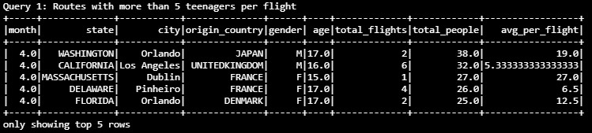

 

# Udacity Data Engineering Nanodegree | Capstone Project

 

### *Arsalan Noorafkan*

**2021-07-16**
 
 

# **Overview**
## Background

 

### *These facts are for a fictional scenario made up for the purposes of this project only*

 

A Human Trafficking Task Force has been tasked with publishing a monthly report outlining suspicious airline activity based on models trained to detect human trafficking and abuse. The team has been provided access to the US government's database of I94 immigration forms (provided as SAS7DBAT files) that are submitted by every non-citizen that enters a US port.

 

## Technology Stack

Amazon S3 - a simple file storage bucket used as the data lake to store the staged raw data files. The reason for choosing this is because in this specific scenario, only a single team of analysts will be using aggregated monthly data to conduct analysis. In future versions where more teams across geographical locations require access to the same data, the team will deploy a Redshift cluster to be used as their data warehouse.

Apache Spark - PySpark is used to extract, clean, and partition the immigration data and store it as parquet files. In this current scenario, the data was provided in a Jupyter environment which was easier to process through Spark. In production, an Airflow DAG will be added to submit a job to a Spark cluster on a regular or as-needed basis.

 

## Methology

The data engineers and scients have decided to break the project into three phases.

Phase 1) Stage the data using Spark and provide clean parquet files stored locally in the team's shared folder to be used for ad hoc analysis from a Jupyter notebook. During this phase, the analysts will load one month of data at a time and conduct exploratory analysis. The results will be exported as a csv file that is used to update a public Tableau dashboard. 

Phase 2) Stage the data using Airflow and schedule regular monthly updates as well as a one-time historical fetch to process data going back to 2015 and stored in an S3 bucket with roles set up for specific superusers in the analytics team. During this phase, the analysts will work with data scientists to conduct analysis on historical data and review month-over-month trends and compare with the first phase's initial findings.

Phase 3) Stage the data using Airflow and schedule regular daily updates and stored in Redshift clusters that allow the data to be more accessible to teams across the country. During this phase, the team will develop a web and mobile app that will be deployed to airport security across the country that allows them to review list of flagged flights and receive notifications are irregular behaviour.

 

## Scenarios

### Scenario 1) The data was increased by 100x
The team will likely start with adding more worker nodes to process the larger amount of data but eventually they might consider AWS EMR or EC2 instances to help process data in a timely manner.

### Scenario 2) The pipelines would be run on a daily basis by 7am every day
The current data pipeline does not include any scheduling mechanism for automatic runs. In this scenario, the data engineering team will utilize Apache Airflow DAGs to automate the task of submitting the job to a Spark cluster on a daily basis at the specified time.

### Scenario 3) The database needed to be accessed by 100+ people
In such scenarios it is best to move the parquet files to a data warehouse solution such as AWS Redshift which provides a highly scalable solution. Another option to consider is storing the data in a relational database such as RDS since it could be more cost efficient but also has limited scaling capabilities.

 

## Hypothesis

The initial hypothesis that the team wants to explore is whether there is a relationship between specific air routes and the number of I94 submissions made for groups of children. They are mainly interested at looking at aggregated data at the month and flight number level in order to capture patterns of behaviour instead of specific outlier events.

Some of the questions and queries that the team would like to explore are:
- For a given month, what was the average passengers per flight for the top 5 cities and origin countries with the most number of I94 submissions for teenagers by age and gender

    

- For a given month, which origin countries and destination cities on average had more than 5 teenagers per flight

    

Future enhancements:
- Find a database of flight numbers and the type/model of the aircraft
    - Compare the total number of suspected victims with the total number of passengers in order to detect outliers in the ratio of passengers being suspected trafficking victims.

 

---

 

# **Schema**

The database will be structured as a star schema that comprises of a fact table with multiple dimension tables. This schema creates denormalized tables that help simplify queries and enable faster aggregations even when using lots of group by, joins, having, and where clauses. It must be noted that a star schema may be less flexible when working on ad-hoc queries and many-to-many relationships are not supported. 

Fact ETL:
- Select only the columns we need
- Change column names to more readable format
- Group by the specified aggregation level
- Add two calculated columns to aggregate the facts
- Return a dataframe

Dimension ETL:
- Select only the columns we need
- Change column names to more readable format
- Return a dataframe

Clean & Join:
- Step 1) Re-format columns in fact table and add calculated fields
- Step 2) Join with country lookup
- Step 3) Join with state lookup
- Step 4) Join with airport lookup

        * Note that the joins were split into 3 separate queries in order to create blocks of code that can be easily replace, changed, remove as needed based new scope changes or scalings
- Return a dataframe
- Write result to parquet files and partition by:
    - Year - mainly necessary once historical data is loaded
    - Month - helps partition by the same aggregation level that the data will be used
    - State - speeds up processing by partitioning by one more finite column (max 54 options)

Validation & Quality Check:
- Validate that the staged dataframe has any records
- Loop through key dimension columns and validate number unique values against expected
- Quality check the Internal Reference IDs for duplicate values
    - this would help indicate whether the aggregation level chosed is not granular enough

 

### **Fact Table - I94 Database - each record is a unique I94 form submitted by a traveller/immigrant**

    - I94YR - 4 digit year
    - I94MON - Numeric month
    - I94CIT - Country code for the origin country
    - I94RES - Country code for the country of resident
    - I94PORT - Airport IATA code
    - ARRDATE - is the Arrival Date in the USA. It is a SAS date numeric field that a permament format has not been applied
    - I94MODE - Mode of transport
    - I94ADDR - State of the destination port
    - DEPDATE - is the Departure Date from the USA. It is a SAS date numeric field that a permament format has not been applied
    - I94BIR - Age of Respondent in Years
    - I94VISA - Visa codes collapsed into three categories
    - COUNT - Used for summary statistics
    - DTADFILE - Character Date Field - Date added to I-94 Files - CIC does not use
    - VISAPOST - Department of State where where Visa was issued - CIC does not use
    - OCCUP - Occupation that will be performed in U.S. - CIC does not use
    - ENTDEPA - Arrival Flag - admitted or paroled into the U.S. - CIC does not use
    - ENTDEPD - Departure Flag - Departed, lost I-94 or is deceased - CIC does not use
    - ENTDEPU - Update Flag - Either apprehended, overstayed, adjusted to perm residence - CIC does not use
    - MATFLAG - Match flag - Match of arrival and departure records
    - BIRYEAR - 4 digit year of birth
    - DTADDTO - Character Date Field - Date to which admitted to U.S. (allowed to stay until) - CIC does not use
    - GENDER - Non-immigrant sex
    - INSNUM - INS number
    - AIRLINE - Airline used to arrive in U.S.
    - ADMNUM - Admission Number
    - FLTNO - Flight number of Airline used to arrive in U.S.
    - VISATYPE - Class of admission legally admitting the non-immigrant to temporarily stay in U.S.
        

### **Dimension Table - Country Codes - lookup table to convert country code to country name**

    - country_code - country code 
    - country_name - full name of the country

### **Dimension Table - US State Codes - lookup table to convert abbreviated US State name to state name**

    - state_code - US state abbreviation codes
    - state_name - full name of the state

### **Dimension Table - Airport Codes - lookup table to convert IATA Airport codes to city names**

    - iata_code - IATA port codes
    - city - full name of the city/municipality

### **Staged Table - I94 Clean & Aggregated Data - each record is an aggregate of total flights and total people**

    - irid - Internal Reference ID to be used as a key identifier
    - year - 4 digit year
    - month - Numeric month
    - state - full state name based on state abbreviated code
    - city - full city name based on port number
    - flight_airline - abbreviated code of the airline
    - flight_number - flight number
    - gender - M, F, U, or X
    - origin_country - country of origin based on converted country code
    - visa_type - Business, Pleasure, or Student
    - age - calculated age based on year of birth
    - birth_year - year of birth
    - birth_age - self-reported age
    - total_flights - estimated count of total flights
    - total_people - total number of people based on i94 submissions

        * Aggregation Level:
            - year & month: since the main purpose of this case study is to analyze monthly patterns, we can roll up to the month level 
            - airline & flight number: allow us to count the estimated total number of flights for a specific route in a month
            - mode of transport: to be used later to filter specifically for air travel
            - visa type: adds context for the analysts to use as a slicer in their reports
            - gender: adds context for the analysts to use as a slicer in their reports
            - birth year & age: adds context for the analysts to use as a slicer in their reports

        * Filters:
            - origin country, airport code, state code, airline, birth year, and gender are NOT NULL
            - Mode of transport = "Air"s

        * Assumptions & Limitations:
            - Count of flights per day assumes a flight number only makes one trip per day since we don't have the arrival/departure times
            - Unreported age, gender, and country of origin will is currently excluded

 
 
 

# **Instructions**
    

 

## Project Structure
- config.cfg: AWS Access Key ID and Secret Access Key
- etl.py: raw data etl and cleaning and validation
- notebook.ipynb: load clean data and run queries

  

## Testing Script
Follow the steps below to test the ETL process using sample JSON data files.

The ETL process comprises of the following steps:

1) Install Python libraries
    >  `pip install pyspark`

2) Create AWS resources
    - S3 bucket us-east-1
    - Enter AWS config and authentication information in the config.cfg file

2) Open a terminal window and cd to the folder that contains the etl.py file
    > cd c:/usr/documents/Project1

3) Run the ETL process and stage the data for analysis by executing the following from the command line:
    >  `python etl.py`

4) Open notebook.ipynb and run the cells to view the results of the sample query

 
REMINDER: Do not include your AWS access keys in your code when sharing this project!
 

---

 

